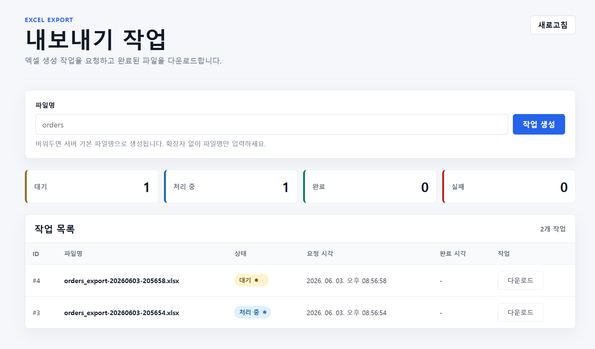

# 사전과제

## 서비스 URL
- https://react-test-iota-neon.vercel.app/

## 서비스 예시 및 사진



## 배포 방식

- Frontend: React 기반 SPA (CSR 구조)
- Reverse Proxy: Nginx
- Backend: Spring Boot API 서버
- Database: MySQL

### 백엔드

- 홈서버 및 docker, nginx

### 프론트 배포 방식

- Vercel

## 실행 방법

```bash
DB_NAME=DB이름 \
DB_USERNAME=DB아이디 \
DB_PASSWORD=DB유저비밀번호 \
docker compose up -d --build
```

## API

- `POST /api/export-jobs` : 엑셀 생성 작업 요청
- `GET /api/export-jobs` : 사용자별 작업 목록 조회
- `GET /api/export-jobs/{jobId}` : 작업 상태 조회
- `GET /api/export-jobs/{jobId}/download` : 생성 완료된 엑셀 다운로드

## 설계시 고민한 점

### BlockingQueue + Worker Thread

- 엑셀 생성은 시간이 오래 걸릴 수 있으므로 HTTP 요청 스레드에서 직접 처리하지 않고 비동기 작업으로 분리
- 별도의 메시지 큐를 도입하기에는 과제 규모가 작다고 판단해, `BlockingQueue`와 단일 Worker Thread로 단순한 작업 큐를 구성
- 요청 저장 이후 트랜잭션 커밋이 완료된 뒤 큐에 등록되도록 처리해, DB에 저장되지 않은 작업이 실행되는 상황 방지

### 데이터 메모리 사용 관련

- 메모리에 많은 데이터가 적재될 시 OOM 이나 STW 로 인해 성능 저하 가능성 고려
- 엑셀 생성 시 메모리 사용량을 줄이기 위해 `SXSSFWorkbook` 기반 스트리밍 방식을 사용

### 사용자 식별 (쿠키 + TTL 방식)

- 쿠키 + TTL 방식으로  관리 시 Session 방식의 사용자 관리보다 데이터 orphan 비율이 더 적을 거라 판단
- 서버 자원 할당량을 생각했을 때, Session 방식까지 채용 시 부담이 된다고 판단

### 데이터 시드 초기화 방식 (ApplicationRunner)

- data.sql 방식 사용 시 DB 방언에 따라 작성하기 때문에 확장성이 떨어진다고 판단
- ApplicationRunner 활용, `JdbcTemplate`와 `JPA` 사용하는 로직 채택

### 엑셀 파일 만료 처리

- 생성된 파일을 영구 보관할 경우 서버 저장 공간 부담이 커질 수 있다고 판단
- TTL 기준으로 만료된 파일을 주기적으로 삭제하도록 처리
- 파일 삭제 후 DB의 filePath를 비워 다운로드 불가능 상태를 구분

## 기술 스택 선택 이유

### nginx 

- HTTPS 환경 및 프록시 서버 역할 위해 사용

### Vercel

- 프론트엔드는 React 기반 SPA이므로 간단한 설정을 통한 배포를 위해

## 구현 못한 부분

- 여러 상황을 고려한 공통 Exception 처리
- 프론트단 에러 처리
- 테스트 코드 작성을 통한 운영 환경 안정화
- CI/CD 환경 구성
- 대용량 적재 대비 페이징 처리
